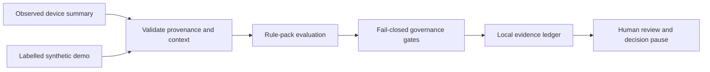

# Privacy Lens

> Evidence before conclusions · 证据先于结论

[English](#english) · [中文](#中文) · [Final thesis PDF](output/pdf/Privacy-Lens-Thesis-Final.pdf) · [Chapter-split TeX package](release/submission-final/tex/) · [Artifact reproduction](ARTIFACT.md) · [Evidence manifest](docs/research/THESIS-EVIDENCE-MANIFEST.md) · [User guide / 用户指南](User-Guide.md) · [Project manual / 项目手册](docs/PROJECT-MANUAL.md) · [Final thesis source / 最终论文源](Thesis/Final/main.tex) · [Rights notice](LICENSE.md)

## English

Privacy Lens is an offline, evidence-first Android research prototype for reviewing permission-activity summaries. It keeps observed-device evidence distinct from synthetic demonstrations, exposes missing context, and prepares questions for proportionate human review. It does **not** determine whether the GDPR was infringed.

### Research question

How can heterogeneous Android privacy evidence be transformed into useful, reproducible review prompts while preventing malformed, missing, synthetic, or legally incomplete evidence from becoming an unsupported legal conclusion?

### Key contributions

- An evidence-bounded architecture that preserves source, time, rule identity, missing context, and prohibited inferences from admission to presentation.
- A fail-closed semantic pipeline with executable safety properties for malformed input, replay, overlap, provenance mixing, pack drift, restart state, and missing tool outputs.
- A versioned regulation-pack boundary that keeps jurisdiction-dependent mappings outside the generic temporal evaluator.
- A typed separation between admitted evidence, technical signal, review obligation, and legal verdict.
- A claim-to-evidence evaluation record spanning deterministic fixtures, curated mutants, a hash-pinned F-Droid corpus, FlowDroid interoperability, and bounded OPPO device observations.

### Delivery status

Version 1.15.0 is the current repository delivery candidate:

- three focused screens: Overview, Findings, and Settings;
- local evidence ledger with Android backup disabled;
- no account, advertising, analytics, evidence upload, Internet permission, or sensitive runtime permission;
- fail-closed regulation-pack, source-review, source-content, attestation, trust-store, rollback, and witness checks;
- a private, session-only decision pause that clears its answers when a finding closes;
- regulation-owned temporal profiles with rule-specific windows and unordered sensor/data combinations; findings remain advisory and non-blocking;
- a debug-only controlled device demonstration compiled from the active pack, visibly labelled synthetic at every bridge and finding boundary;
- a minimal local temporal ledger that restores only same-pack, same-version, in-window, de-duplicated observations and fails closed on invalid state;
- five GDPR temporal rule cards with assumptions, counterexamples, sources, and explicit non-assurance review status;
- a separate regulation-to-temporal-rule mapping compiler, so mounting another valid pack changes the detection configuration without hard-coding GDPR combinations in the evaluator;
- a loadable, validated formal-policy model whose legal constraints request missing evidence rather than infer a legal violation from static or observed predicates;
- a read-only commercial-APK comparison with Android SDK static analysis and a bounded Exodus-signature-method baseline; results preserve hashes and limitations but never APK binaries;
- deterministic compliance, governance, accessibility-source, privacy-release, TypeScript, lint, and delivery checks;
- physical-device evidence from one OPPO PERM00 handset, clearly bounded to a short acceptance sample.

The production root store, witnessed trust-store envelope, and qualified legal-review attestation are intentionally unprovisioned. The app therefore blocks reassuring legal-review states. Repository builds use a QA/debug certificate; Play upload signing and store declarations remain owner-controlled work.

### Evidence flow



The screen layer cannot create a reassuring result by itself. Regulation metadata, official-source records, source-content manifests, review attestations, trust anchors, witness receipts, and rollback state are evaluated below the UI.

### Screens


### Quick start

Prerequisites: Node.js 20--24, npm 10, Java 17, Android SDK 36, and an Expo 54-compatible Android NDK. Only Node and npm are needed to reproduce the thesis-core results; the Android toolchain is only needed to build the app or run the Kotlin tests.

```powershell
git clone https://github.com/zhiheng-zhang-Mera/GDPR-project.git
Set-Location GDPR-project
git switch dev/thesis-finalization-alien
npm ci
npm run reproduce:thesis-core
npm start
```

> **Use this branch, not the tag.** Tag `v1.15.0-thesis-final` points at commit `acffee1e`, the pre-finalisation revision. It is immutable and still published, and its tree carries a thesis PDF from before the chapter-5 corrections plus a `package.json` without the PDF and submission-manifest guards. Reproducing from that tag would rebuild the retracted thesis. A successor tag, or merging this branch into `9-8-Finalize`, is an owner-controlled release action.

`npm run reproduce:thesis-core` is the canonical core verification path. It should exit 0 and leave `git status` clean. If it reports a stale generated file, do not hand-edit the file: run the command named in the error.

### Reproduction commands

Each command is labelled with what it needs. `HOST-ONLY` means one machine and no device; nothing here requires an emulator.

| Command | Needs | What it verifies |
|---|---|---|
| `npm run reproduce:thesis-core` | HOST-ONLY | The core thesis claims: semantic suites, accessibility and release-privacy contracts, TypeScript, lint, delivery structure, formal properties, mapping packet, generated summaries and macros, evidence hashes, thesis numeric consistency, claim boundaries, cited-path existence, and LaTeX source quality |
| `npm run verify` | HOST-ONLY | The same checks plus executable mutation detection |
| `npm run reproduce:thesis-stress` | HOST-ONLY | The high-volume fixed-seed temporal campaign, run twice, requiring identical deterministic results. Writes receipts under `artifacts/reproduction/` |
| `npm run verify:mutation` | HOST-ONLY | Applies each registered source weakening in a throwaway tree, recompiles, and requires the suite to catch it |
| `npm run verify:pdf` | HOST-ONLY | Extracts the text of both shipped thesis PDFs and fails if a corrected claim is missing or a retracted figure such as 150,010 has reappeared. Runs as part of `reproduce:thesis-core` |
| `npm run reproduce:thesis-pdf` | OPTIONAL (TeX Live or TinyTeX) | Re-renders the thesis byte-reproducibly (`SOURCE_DATE_EPOCH` pinned) and reports whether the result matches the published digest |
| `npm run test:android-unit` | HOST-ONLY (Android SDK + JDK) | 24 JUnit tests for the native audit-bridge mapping |
| `npm run test:thesis-numbers` | HOST-ONLY | Thesis prose against pack sources, receipts, the evidence manifest, and generated macros |
| `npm run android:qa` | OPTIONAL (Android SDK) | Debug APK for a device or emulator |
| `.\android\gradlew.bat assembleRelease bundleRelease` | OPTIONAL (Android SDK + NDK) | Release APK and AAB |
| `scripts/run-real-device-extended-qa.ps1` | ANDROID DEVICE REQUIRED | Physical-device acceptance run |

The F-Droid corpus crawl, the 233-package device campaign, and the FlowDroid invocation are **not** reproducible from this repository: they need restricted APKs, a physical handset, or an external JAR. Their receipts are pinned by hash and their derived metrics are re-verified on every run.

### Android requirements

- **Host-only work** (default): Android SDK with platform 36 and build-tools 36.0.0, any JDK 17+, NDK 27.1.x for native compilation. No emulator, no Android Studio, no connected device.
- **Device work** (optional): an ARM64 Android 12+ handset with USB debugging, plus `adb`.
- **Emulator**: not required by any command in this repository. See `artifacts/final-audit/ANDROID_RUNTIME_JUSTIFICATION.md`.

For an Android source build:

```powershell
$env:NODE_ENV = 'production'
Set-Location android
.\gradlew.bat assembleRelease bundleRelease --no-daemon --console=plain -PreactNativeArchitectures=arm64-v8a
```

APK/AAB files are deliberately excluded from source control. Before public distribution, configure an owner-controlled upload key and follow [store readiness](docs/store-readiness.md).

### Generated outputs

| Path | Generated by | Tracked? |
|---|---|---|
| `output/thesis-results/*.json` | `node scripts/summarize-thesis-results.js --write` | tracked |
| `Thesis/Final/generated-results.tex` | `node scripts/verify-thesis-evidence.js --write` | tracked |
| `release/submission-final/tex/*` | copied from `Thesis/Final/*`; equality enforced by `verify:delivery` | tracked |
| `artifacts/reproduction/<host>/*.json` | `npm run reproduce:thesis-stress` | gitignored |
| `artifacts/mutation/mutation-verification.json` | `npm run verify:mutation` | gitignored |
| `android/app/build/**` | Gradle | gitignored |

Never edit a tracked generated file by hand. `npm run verify:generated-results` and `npm run verify:thesis-evidence` fail if one is stale.

### Thesis mapping

| Thesis chapter | Primary repository artifact |
|---|---|
| Ch. 3 — Requirements and architecture | `src/compliance/`, `src/regulations/`, `docs/research/FORMAL-EVIDENCE-MODEL.md` |
| Ch. 4 — Implementation | `src/compliance/RulePackComplianceEngine.ts`, `android/app/src/main/java/.../privacy/`, `app/(tabs)/` |
| Ch. 5 — Evaluation and results | `tests/`, `scripts/verify-*.js`, `docs/research/thesis-evidence-manifest.json`, `testing-report/` |
| Ch. 5 — Numeric claims | `output/thesis-results/`, `Thesis/Final/generated-results.tex` |
| Ch. 6 — Limitations | `docs/research/CLAIM-EVIDENCE-MATRIX.md`, `docs/research/P2-EXTENSION-REGISTER.md` |
| Claims and boundaries | `docs/research/CLAIM-EVIDENCE-MATRIX.md`, `scripts/verify-claim-boundaries.js` |

### Known limitations

- The rule thresholds are research baselines, not statutory limits, and the app never determines whether the GDPR was infringed.
- Ordinary Android apps cannot read unrestricted AppOps history for other apps, so a blank audit is an evidence gap rather than proof that nothing occurred.
- The device evidence comes from one OPPO PERM00 handset over a short interval; it is not a multi-OEM, long-run, or population result.
- Independent legal mapping review, participant comprehension, accessibility conformance, production signing, and store acceptance have **not** been established.
- The thesis PDF is now rendered from the corrected source and checked for stale content on every `reproduce:thesis-core` run: `verify:pdf` fails if a retracted figure such as the old 150,010 stress total reappears. `npm run reproduce:thesis-pdf` re-renders it byte-reproducibly on any host with a TeX installation.
- Reproducing a release APK yields different bytes than another host: builds embed environment-dependent metadata. Artifact size and permission facts reproduce; binary hashes do not.

### Troubleshooting

| Symptom | Cause and fix |
|---|---|
| `Evidence source hash drift` | Your checkout converted line endings. Confirm it with `git config core.autocrlf`; the repository sets `* -text` in `.gitattributes`, so re-checkout with `git rm --cached -r . ; git reset --hard`. |
| A compliance assertion fails with an unexpected `INSUFFICIENT_EVIDENCE` | A recorded pack source-review deadline has passed, which correctly activates the fail-closed gate. This is intended production behaviour; the test suites pin their evaluation date so their oracle does not move. |
| `generated-results.tex is stale` | Run `node scripts/verify-thesis-evidence.js --write`, then `node scripts/summarize-thesis-results.js --write`. |
| `chapter-split submission source differs from Thesis/Final` | Copy the named file from `Thesis/Final/` into `release/submission-final/tex/`. |
| Gradle cannot find the Android SDK | Set `ANDROID_HOME`. The analysis scripts also honour `ANDROID_HOME`/`ANDROID_SDK_ROOT` and per-tool flags such as `--aapt`. |
| `pdflatex` hangs on the thesis | The host's LaTeX distribution is trying to install packages interactively. Install TeX Live or TinyTeX, or set `PDFLATEX_BIN` to a directory containing `pdflatex`. `verify:pdf` and `reproduce:thesis-core` work without a TeX installation; only `reproduce:thesis-pdf` needs one. |

### Repository map

| Path | Purpose |
|---|---|
| `app/(tabs)/` | Overview, Findings, and Settings screens |
| `components/privacy/` | Shared finding and navigation components |
| `src/compliance/` | Input validation, evaluation, evidence, and decision readiness |
| `src/regulations/` | Regulation packs and fail-closed governance chain |
| `src/context/PrivacyContext.tsx` | Orchestration and local persistence boundary |
| `android/.../privacy/` | Native audit bridge and WorkManager workers |
| `tests/` | Deterministic and contract checks |
| `testing-report/` | Versioned acceptance evidence; not broad validation |
| `Thesis/Final/` | Self-contained final thesis source: `main.tex`, seven chapters, and bibliography |
| `Thesis Version/` | Preserved thesis source and review history |
| `output/pdf/` | Versioned compiled thesis PDFs |
| `release/submission-final/` | Final public package, reproduction guide, identity, and checksums |

### Citation and immutable archive

Zhang, Z. (2026). *Privacy Lens: Evidence-Bounded Android Privacy Review with Regulation-Driven Temporal Combination Notices*, version 1.15.0.

The tag `v1.15.0-thesis-final` resolves to commit `acffee1e`, which predates the finalisation corrections; its exact commit and release-asset checksums are published with the GitHub release. The corrected source of truth is branch `dev/thesis-finalization-alien` at the commit recorded in `artifacts/final-audit/SUBMISSION_MANIFEST.json`, whose thesis PDF digest is published there and in `release/submission-final/SHA256SUMS.txt`.

### Claim boundaries

- Ordinary Android apps cannot inspect unrestricted AppOps history for other apps.
- A blank audit is not proof that no access occurred.
- WorkManager timing is deferrable and OEM-dependent.
- The controlled device demo is synthetic debug evidence routed through the native bridge; it does not observe another app or establish a real privacy event.
- Temporal state is local and bounded by the active pack's largest window; clearing local findings removes this state, while an incompatible or damaged restart snapshot is discarded.
- Synthetic precision/recall measures agreement with generated labels, not real-world or legal accuracy.
- Local rollback state is not tamper-resistant and can be lost after uninstall, data clearing, unsuitable restore, or device compromise.
- Internal artifact scores, tests, and one-device QA are not a legal opinion, participant study, certification, peer review, or publication decision.

## 中文

Privacy Lens 是一款离线运行、证据优先的 Android 隐私审查研究原型。它将设备观测证据与合成演示严格分开，明确展示缺失语境，并帮助用户在采取行动前形成适度、可复核的问题。它**不会**判断是否发生 GDPR 侵权。

### 交付状态

版本 1.15.0 是当前仓库交付候选：

- 界面收敛为概览、发现和设置三个页面；
- 证据账本仅保存在应用私有空间，且 Android 备份已关闭；
- 无账户、广告、分析 SDK、证据上传、互联网权限或敏感运行时权限；
- 法规包、来源复核、来源内容、法律复核签名、信任库、回滚和见证策略均采用失败关闭；
- 决策暂停答案仅存在于当前打开的卡片中，关闭卡片即清除；
- 法规包分别声明检测窗口与无序传感器/数据组合，结果仅作提示且不拦截 App；
- 法规包与通用时间组合评估器之间采用独立转换模块，切换有效法规包即可切换检测配置，而不在评估器中写死 GDPR 组合；
- 可加载且经过校验的形式化策略模型将法律约束表达为“需要补充的证据”，不会从静态或观测谓词直接推断法律违规；
- 使用 Android SDK 静态分析和有界 Exodus 签名方法对商业 APK 进行只读横向比较；结果仅保留哈希与限制，不保存 APK 二进制；
- 具备确定性合规、治理、无障碍源代码、发布隐私、TypeScript、Lint 和交付结构检查；
- 实体设备证据来自一台 OPPO PERM00，仅证明短时验收样本中的观察结果。

生产根信任库、见证信任库封装和合格法律复核证明仍未配置，因此应用会阻断安抚性的法律复核状态。仓库构建使用 QA/调试证书；Play 上传签名、Data safety、支持邮箱和商店发布仍由项目所有者完成。

### 快速开始

准备 Node.js 20--24、npm 10、Java 17、Android SDK 36，以及兼容 Expo 54 的 Android NDK，然后执行：

```powershell
git clone https://github.com/zhiheng-zhang-Mera/GDPR-project.git
Set-Location GDPR-project
git switch dev/thesis-finalization-alien
npm ci
npm run reproduce:thesis-core
npm start
```

> **请使用本分支，不要使用 tag。** `v1.15.0-thesis-final` 指向提交 `acffee1e`，即收尾修正之前的版本。该 tag 不可变且已发布，其代码树中的论文 PDF 早于第 5 章修正，且 `package.json` 尚无 PDF 与提交清单校验。从该 tag 复现会重建已撤回的论文内容。创建后继 tag 或将本分支合入 `9-8-Finalize` 属于项目所有者控制的发布操作。

源代码仓库不保存 APK/AAB。正式分发前请配置独立上传密钥，并逐项完成[商店就绪清单](docs/store-readiness.md)。

### 复现命令

下表标注了每条命令所需的运行环境。**仅主机**表示只需一台机器，不需要模拟器或真机。

| 命令 | 环境要求 | 验证内容 |
|---|---|---|
| `npm run reproduce:thesis-core` | 仅主机 | 论文核心主张：语义测试、无障碍与发布隐私契约、TypeScript、Lint、交付结构、形式化性质、映射评审包、生成的汇总与宏、证据哈希、论文数字一致性、主张边界、引用路径存在性、LaTeX 源质量 |
| `npm run verify` | 仅主机 | 上述全部检查，外加可执行的变异检测 |
| `npm run reproduce:thesis-stress` | 仅主机 | 固定随机种子的高量时序压力测试，连续运行两次并要求确定性结果完全一致，回执写入 `artifacts/reproduction/` |
| `npm run verify:mutation` | 仅主机 | 在临时目录中逐个注入已登记的源码弱化并重新编译，要求测试必须捕获 |
| `npm run verify:pdf` | 仅主机 | 提取两份论文 PDF 的文本，若修正后的表述缺失或已撤回的旧数字（如 150,010）重新出现则失败。已包含在 `reproduce:thesis-core` 中 |
| `npm run reproduce:thesis-pdf` | 可选（TeX Live 或 TinyTeX） | 逐字节可复现地重新渲染论文（固定 `SOURCE_DATE_EPOCH`），并报告结果是否与已发布摘要一致 |
| `npm run test:android-unit` | 仅主机（需 Android SDK 与 JDK） | 原生审计桥接映射的 24 个 JUnit 测试 |
| `npm run test:thesis-numbers` | 仅主机 | 论文正文与法规包源码、实验回执、证据清单、生成宏之间的一致性 |
| `.\android\gradlew.bat assembleRelease bundleRelease` | 可选（Android SDK 与 NDK） | 发布 APK 与 AAB |
| `scripts/run-real-device-extended-qa.ps1` | 需要真机 | 实体设备验收 |

F-Droid 语料抓取、233 个安装包的设备实验和 FlowDroid 调用**无法**由本仓库复现：它们需要受限的 APK、实体手机或外部 JAR。这些实验的回执已按哈希固定，其派生指标在每次运行时重新校验。

### 已知限制

- 规则阈值是研究基线，不是法定上限；应用不会判断是否发生 GDPR 侵权；
- 普通 Android 应用无法读取其他应用不受限制的 AppOps 历史，空白审查结果属于证据缺口，而非“没有发生”；
- 设备证据来自一台 OPPO PERM00 与一个短时窗口，不代表多 OEM、长时间或总体结果；
- 独立法律映射复核、用户理解实验、无障碍合规、生产签名与商店审核**均未**完成；
- `output/pdf/` 与 `release/submission-final/` 下的论文 PDF 已由修正后的源码重新渲染；`reproduce:thesis-core` 每次都会运行 `verify:pdf`，一旦已撤回的旧数字（例如 150,010）重新出现即会失败。在装有 TeX 的主机上可用 `npm run reproduce:thesis-pdf` 逐字节可复现地重新渲染；
- 不同主机构建出的 APK 字节不同：构建会嵌入环境相关信息。体积与权限事实可复现，二进制哈希不可复现。

### 故障排查

| 现象 | 原因与处理 |
|---|---|
| 出现 `Evidence source hash drift` | 检出行尾被转换。用 `git config core.autocrlf` 确认；仓库已在 `.gitattributes` 中设置 `* -text`，改为 `git rm --cached -r . ; git reset --hard` 重新检出即可 |
| 合规断言出现意外的 `INSUFFICIENT_EVIDENCE` | 法规包中记录的来源复核期限已过，失败关闭门控正常生效。这是预期的生产行为；测试套件已固定评估日期，因此其判定基准不会随时间漂移 |
| 出现 `generated-results.tex is stale` | 依次运行 `node scripts/verify-thesis-evidence.js --write` 与 `node scripts/summarize-thesis-results.js --write` |
| 出现 `chapter-split submission source differs from Thesis/Final` | 将报错文件从 `Thesis/Final/` 复制到 `release/submission-final/tex/` |
| Gradle 找不到 Android SDK | 设置 `ANDROID_HOME`。分析脚本同样支持 `ANDROID_HOME`/`ANDROID_SDK_ROOT` 以及 `--aapt` 等单工具参数 |
| 编译论文时 `pdflatex` 卡住 | 本机 LaTeX 发行版正在交互式安装宏包。请安装 TeX Live 或 TinyTeX，或用 `PDFLATEX_BIN` 指向含 `pdflatex` 的目录。`verify:pdf` 与 `reproduce:thesis-core` 无需 TeX 即可运行，只有 `reproduce:thesis-pdf` 需要 |

### 阅读顺序

1. 首次使用者先阅读[用户指南](User-Guide.md)。
2. 开发者和维护者阅读[项目手册](docs/PROJECT-MANUAL.md)。
3. 查看[初次接触项目审查](docs/FIRST-CONTACT-REVIEW.md)，了解本轮清洗依据。
4. 发布负责人核对[最终交付清单](docs/DELIVERY-CHECKLIST.md)。
5. 法规与密钥负责人阅读[法律复核密钥治理](docs/legal-review-key-governance.md)。
6. 研究人员阅读[预注册草案](docs/research/decision-pause-preregistration.md)及其数据字典。
7. 论文交付阅读 [Thesis/Final/main.tex](Thesis/Final/main.tex)；历史源稿单独保留，不构成最终稿的一部分。

### 重要边界

- 普通 Android 应用无法读取其他应用不受限制的 AppOps 历史；
- 空白审查结果不代表没有发生访问；
- WorkManager 的执行时间可能受系统和 OEM 延迟；
- 受控设备演示是经原生桥接回送的 Debug 合成证据，不会观察其他 App，也不代表真实隐私事件；
- 时间状态只保存在本地，并受当前法规包最大窗口限制；清除本地发现会移除此状态，重启快照不兼容、损坏或过期时会被丢弃；
- 合成指标只验证生成标签与实现一致，不代表真实世界或法律判断准确率；
- 本地回滚状态不具备防篡改能力，卸载、清除数据、不适当恢复或设备失陷可能使其丢失；
- 内部评分、自动测试和单设备验收不等于法律意见、真人实验、认证、同行评审或期刊录用。

本仓库采用保守的[权利声明](LICENSE.md)：版权所有，未授予再分发许可。第三方依赖和外部数据仍适用各自条款。
