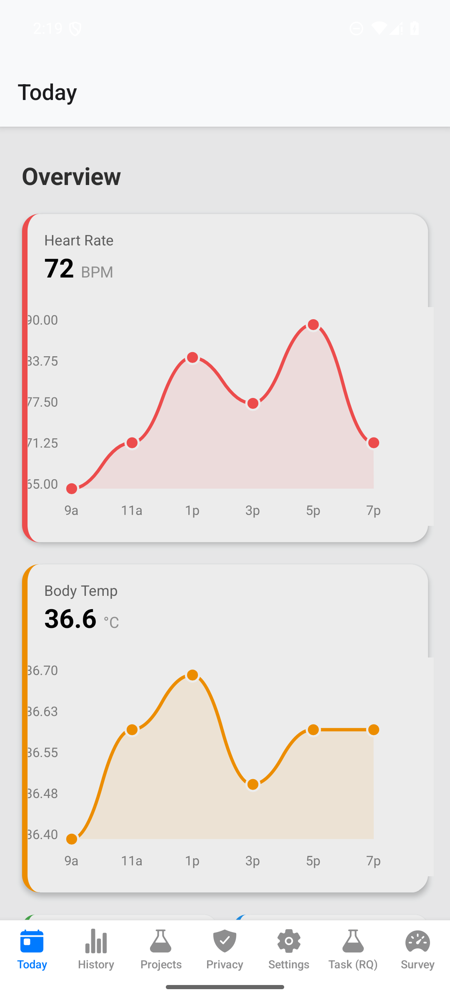

# GDPR Android Permission Audit

一款面向移动健康场景的 Android 隐私问责与研究原型。应用将权限访问记录转换为可解释的 GDPR 风险提示，并提供受控模拟、合规规则验证、研究任务和健康数据界面。

> 本应用提供技术风险提示，不作出法律合规结论。跨应用权限历史的完整可见性取决于 Android 版本、OEM 策略以及设备所有者或研究固件权限。

## 下载与安装

仓库根目录提供可直接安装的 APK：

- `GDPR-Permission-Audit-1.0.0-x86_64.apk`
- 包名：`com.anonymous.mymobileapp`
- 最低 Android 版本：Android 7.0 / API 24
- 目标版本：Android API 36
- 架构：x86_64（Android Emulator、部分 x86_64 设备）
- 签名：演示用调试签名，不适用于应用商店正式发布
- SHA-256：`E4BF799D6654A03067BB5A5995560DF4C60FDB666DCD6D8E592A69558008A14C`

安装命令：

```bash
adb install -r GDPR-Permission-Audit-1.0.0-x86_64.apk
```

完整操作步骤见 [User-Guide.md](User-Guide.md)。

## 实际界面

### 健康数据首页

首页展示心率、体温等示例健康指标及趋势，用于提供移动健康应用的研究情境。



### 隐私问责仪表盘

仪表盘区分需要处理、证据缺失和无技术异常三种摘要，并显示 50 轮受控评估结果。每条结果保留权限、软件包、技术信号、建议动作及法律免责声明。


### 研究任务

研究页面支持 A/B/C 三组交互条件和六项 GDPR 场景任务，用于对比标准设置、动态隐私界面和文本密集型流程。


## 核心能力

- **低频权限审计**：通过 WorkManager 调度每日审计和手动即时审计。
- **可解释合规规则**：覆盖位置、麦克风和联系人权限，输出阈值、风险等级、触发信号与 GDPR 条款映射。
- **受控违规模拟**：随机生成权限类型、50–200 次事件和 24 小时触发时间，且不会调用真实传感器或采集个人数据。
- **50 轮逻辑评估**：包含 40 个违规样本和 10 个控制样本，计算 TP、FP、FN、Precision 与 Recall。
- **证据分级**：明确区分 `LIKELY_NON_COMPLIANT`、`REVIEW_REQUIRED`、`INSUFFICIENT_EVIDENCE` 和 `NO_TECHNICAL_CONCERN`。
- **本地数据保存**：使用 AsyncStorage 和 Android 本地偏好保存审计结果及模拟进度。
- **研究实验界面**：提供六个双语 GDPR 任务、三种交互组别及评分/问卷入口。

## 应用导航

| 页面 | 用途 |
| --- | --- |
| Today | 查看健康指标和趋势图 |
| History | 查看历史数据 |
| Projects | 管理研究项目 |
| Privacy | 运行权限审计、50 轮评估及查看证据 |
| Settings | 调整隐私与应用设置 |
| Task (RQ) | 执行 A/B/C 组研究任务 |
| Survey | 完成研究问卷 |

## 技术结构

- Expo 54、React Native 0.81、TypeScript
- Kotlin 原生模块和 React Native Bridge
- Android WorkManager 后台调度
- `GDPRComplianceEngine` 可插拔规则引擎
- AsyncStorage 本地结果与通知去重
- Android SDK 36，最低 SDK 24

主要实现位置：

```text
app/(tabs)/                         应用页面与导航
src/compliance/                     合规规则、类型、模拟器和指标
src/services/PrivacyBridge.ts       JavaScript/Android 桥接
android/app/src/main/java/.../privacy/
                                    原生审计与模拟 Worker
tests/runComplianceTests.ts         合规逻辑验证
Thesis Version/                     保留版本号的论文 LaTeX 文件
```

## 从源码构建

```bash
npm install
cd android
gradlew.bat :app:assembleRelease -PreactNativeArchitectures=x86_64 --no-daemon --console=plain
```

Release APK 默认生成于：

```text
android/app/build/outputs/apk/release/app-release.apk
```

## 已验证状态

- x86_64 Release APK 构建成功。
- 已在 `emulator-5554` 安装并离线启动。
- 主进程启动正常，首页、Privacy 和 Task (RQ) 页面均已通过 UI 树与截图检查。
- 50 轮受控评估：TP 40、FP 0、FN 0、Precision 100%、Recall 100%。
- 该结果只证明实现与受控 ground truth 一致，不代表真实世界 GDPR 侵权识别准确率。

## 已知限制

- 根目录 APK 只包含 x86_64，不适用于常见 ARM64 实体手机。
- Release 构建当前使用演示调试签名，正式发布前必须更换独立密钥并保护凭据。
- 普通 Android 应用通常无法读取其他应用的完整 AppOps 历史；完整研究需要获得授权的设备所有者或研究固件环境。
- WorkManager 触发时间不是精确定时，系统可因 Doze、电量和 OEM 策略延迟任务。
- 模拟事件是合成证据，不会调用真实位置、麦克风或联系人 API。
- 当前持久化适合研究原型；长周期并发实验应迁移至 Room 数据库。

## 免责声明

本项目用于技术研究和教学演示，不构成法律意见、合规认证或生产级安全控制。
