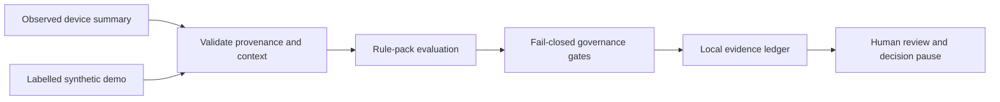
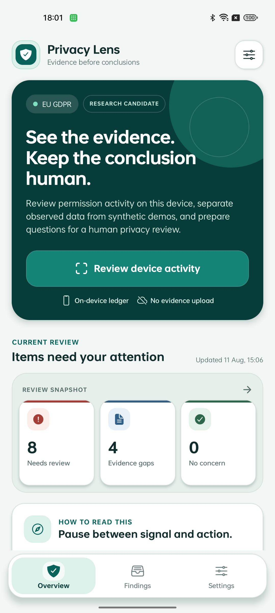
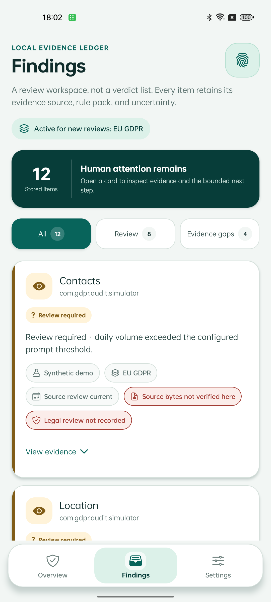
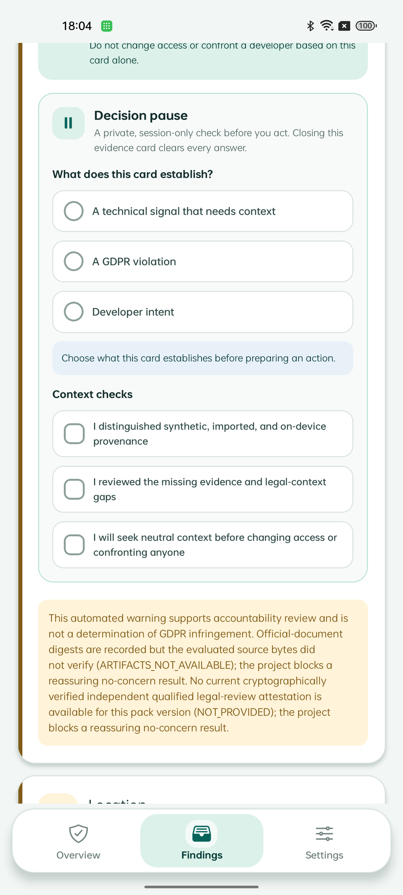

# Privacy Lens

> Evidence before conclusions · 证据先于结论

[English](#english) · [中文](#中文) · [Final thesis PDF](output/pdf/Privacy-Lens-Thesis-Final.pdf) · [Chapter-split TeX package](release/submission-final/tex/) · [Artifact reproduction](ARTIFACT.md) · [Evidence manifest](docs/research/THESIS-EVIDENCE-MANIFEST.md) · [User guide / 用户指南](User-Guide.md) · [Project manual / 项目手册](docs/PROJECT-MANUAL.md) · [Final thesis source / 最终论文源](Thesis/Final/main.tex) · [Rights notice](LICENSE.md)

## English

Privacy Lens is an offline, evidence-first Android research prototype for reviewing permission-activity summaries. It keeps observed-device evidence distinct from synthetic demonstrations, exposes missing context, and prepares questions for proportionate human review. It does **not** determine whether the GDPR was infringed.

### Research question

How can heterogeneous Android privacy evidence be transformed into useful, reproducible review prompts while preventing malformed, missing, synthetic, or legally incomplete evidence from becoming an unsupported legal conclusion?

### Key contributions

- An evidence-bounded architecture that preserves source, time, rule identity, missing context, and prohibited inferences from admission to presentation.
- A fail-closed semantic pipeline with executable safety properties for malformed input, replay, overlap, provenance mixing, pack drift, restart state, and missing tool outputs.
- A versioned regulation-pack boundary that keeps jurisdiction-dependent mappings outside the generic temporal evaluator.
- A typed separation between admitted evidence, technical signal, review obligation, and legal verdict.
- A claim-to-evidence evaluation record spanning deterministic fixtures, curated mutants, a hash-pinned F-Droid corpus, FlowDroid interoperability, and bounded OPPO device observations.

### Delivery status

Version 1.15.0 is the current repository delivery candidate:

- three focused screens: Overview, Findings, and Settings;
- local evidence ledger with Android backup disabled;
- no account, advertising, analytics, evidence upload, Internet permission, or sensitive runtime permission;
- fail-closed regulation-pack, source-review, source-content, attestation, trust-store, rollback, and witness checks;
- a private, session-only decision pause that clears its answers when a finding closes;
- regulation-owned temporal profiles with rule-specific windows and unordered sensor/data combinations; findings remain advisory and non-blocking;
- a debug-only controlled device demonstration compiled from the active pack, visibly labelled synthetic at every bridge and finding boundary;
- a minimal local temporal ledger that restores only same-pack, same-version, in-window, de-duplicated observations and fails closed on invalid state;
- five GDPR temporal rule cards with assumptions, counterexamples, sources, and explicit non-assurance review status;
- a separate regulation-to-temporal-rule mapping compiler, so mounting another valid pack changes the detection configuration without hard-coding GDPR combinations in the evaluator;
- a loadable, validated formal-policy model whose legal constraints request missing evidence rather than infer a legal violation from static or observed predicates;
- a read-only commercial-APK comparison with Android SDK static analysis and a bounded Exodus-signature-method baseline; results preserve hashes and limitations but never APK binaries;
- deterministic compliance, governance, accessibility-source, privacy-release, TypeScript, lint, and delivery checks;
- physical-device evidence from one OPPO PERM00 handset, clearly bounded to a short acceptance sample.

The production root store, witnessed trust-store envelope, and qualified legal-review attestation are intentionally unprovisioned. The app therefore blocks reassuring legal-review states. Repository builds use a QA/debug certificate; Play upload signing and store declarations remain owner-controlled work.

### Evidence flow



The screen layer cannot create a reassuring result by itself. Regulation metadata, official-source records, source-content manifests, review attestations, trust anchors, witness receipts, and rollback state are evaluated below the UI.

### Screens







### Quick start

Prerequisites: Node.js 20--24, npm 10, Java 17, Android SDK 36, and an Expo 54-compatible Android NDK.

```powershell
git clone https://github.com/zhiheng-zhang-Mera/GDPR-project.git
Set-Location GDPR-project
git switch 9-8-Finalize
npm ci
npm run reproduce:thesis-core
npm start
```

For an Android source build:

```powershell
$env:NODE_ENV = 'production'
Set-Location android
.\gradlew.bat assembleRelease bundleRelease --no-daemon --console=plain -PreactNativeArchitectures=arm64-v8a
```

APK/AAB files are deliberately excluded from source control. Before public distribution, configure an owner-controlled upload key and follow [store readiness](docs/store-readiness.md).

### Repository map

| Path | Purpose |
|---|---|
| `app/(tabs)/` | Overview, Findings, and Settings screens |
| `components/privacy/` | Shared finding and navigation components |
| `src/compliance/` | Input validation, evaluation, evidence, and decision readiness |
| `src/regulations/` | Regulation packs and fail-closed governance chain |
| `src/context/PrivacyContext.tsx` | Orchestration and local persistence boundary |
| `android/.../privacy/` | Native audit bridge and WorkManager workers |
| `tests/` | Deterministic and contract checks |
| `testing-report/` | Versioned acceptance evidence; not broad validation |
| `Thesis/Final/` | Self-contained final thesis source: `main.tex`, seven chapters, and bibliography |
| `Thesis Version/` | Preserved thesis source and review history |
| `output/pdf/` | Versioned compiled thesis PDFs |
| `release/submission-final/` | Final public package, reproduction guide, identity, and checksums |

### Citation and immutable archive

Zhang, Z. (2026). *Privacy Lens: Evidence-Bounded Android Privacy Review with Regulation-Driven Temporal Combination Notices*, version 1.15.0. The immutable identity is tag `v1.15.0-thesis-final`; its exact commit and release-asset checksums are published with the GitHub release.

### Claim boundaries

- Ordinary Android apps cannot inspect unrestricted AppOps history for other apps.
- A blank audit is not proof that no access occurred.
- WorkManager timing is deferrable and OEM-dependent.
- The controlled device demo is synthetic debug evidence routed through the native bridge; it does not observe another app or establish a real privacy event.
- Temporal state is local and bounded by the active pack's largest window; clearing local findings removes this state, while an incompatible or damaged restart snapshot is discarded.
- Synthetic precision/recall measures agreement with generated labels, not real-world or legal accuracy.
- Local rollback state is not tamper-resistant and can be lost after uninstall, data clearing, unsuitable restore, or device compromise.
- Internal artifact scores, tests, and one-device QA are not a legal opinion, participant study, certification, peer review, or publication decision.

## 中文

Privacy Lens 是一款离线运行、证据优先的 Android 隐私审查研究原型。它将设备观测证据与合成演示严格分开，明确展示缺失语境，并帮助用户在采取行动前形成适度、可复核的问题。它**不会**判断是否发生 GDPR 侵权。

### 交付状态

版本 1.15.0 是当前仓库交付候选：

- 界面收敛为概览、发现和设置三个页面；
- 证据账本仅保存在应用私有空间，且 Android 备份已关闭；
- 无账户、广告、分析 SDK、证据上传、互联网权限或敏感运行时权限；
- 法规包、来源复核、来源内容、法律复核签名、信任库、回滚和见证策略均采用失败关闭；
- 决策暂停答案仅存在于当前打开的卡片中，关闭卡片即清除；
- 法规包分别声明检测窗口与无序传感器/数据组合，结果仅作提示且不拦截 App；
- 法规包与通用时间组合评估器之间采用独立转换模块，切换有效法规包即可切换检测配置，而不在评估器中写死 GDPR 组合；
- 可加载且经过校验的形式化策略模型将法律约束表达为“需要补充的证据”，不会从静态或观测谓词直接推断法律违规；
- 使用 Android SDK 静态分析和有界 Exodus 签名方法对商业 APK 进行只读横向比较；结果仅保留哈希与限制，不保存 APK 二进制；
- 具备确定性合规、治理、无障碍源代码、发布隐私、TypeScript、Lint 和交付结构检查；
- 实体设备证据来自一台 OPPO PERM00，仅证明短时验收样本中的观察结果。

生产根信任库、见证信任库封装和合格法律复核证明仍未配置，因此应用会阻断安抚性的法律复核状态。仓库构建使用 QA/调试证书；Play 上传签名、Data safety、支持邮箱和商店发布仍由项目所有者完成。

### 快速开始

准备 Node.js 20--24、npm 10、Java 17、Android SDK 36，以及兼容 Expo 54 的 Android NDK，然后执行：

```powershell
git clone https://github.com/zhiheng-zhang-Mera/GDPR-project.git
Set-Location GDPR-project
git switch 9-8-Finalize
npm ci
npm run reproduce:thesis-core
npm start
```

源代码仓库不保存 APK/AAB。正式分发前请配置独立上传密钥，并逐项完成[商店就绪清单](docs/store-readiness.md)。

### 阅读顺序

1. 首次使用者先阅读[用户指南](User-Guide.md)。
2. 开发者和维护者阅读[项目手册](docs/PROJECT-MANUAL.md)。
3. 查看[初次接触项目审查](docs/FIRST-CONTACT-REVIEW.md)，了解本轮清洗依据。
4. 发布负责人核对[最终交付清单](docs/DELIVERY-CHECKLIST.md)。
5. 法规与密钥负责人阅读[法律复核密钥治理](docs/legal-review-key-governance.md)。
6. 研究人员阅读[预注册草案](docs/research/decision-pause-preregistration.md)及其数据字典。
7. 论文交付阅读 [Thesis/Final/main.tex](Thesis/Final/main.tex)；历史源稿单独保留，不构成最终稿的一部分。

### 重要边界

- 普通 Android 应用无法读取其他应用不受限制的 AppOps 历史；
- 空白审查结果不代表没有发生访问；
- WorkManager 的执行时间可能受系统和 OEM 延迟；
- 受控设备演示是经原生桥接回送的 Debug 合成证据，不会观察其他 App，也不代表真实隐私事件；
- 时间状态只保存在本地，并受当前法规包最大窗口限制；清除本地发现会移除此状态，重启快照不兼容、损坏或过期时会被丢弃；
- 合成指标只验证生成标签与实现一致，不代表真实世界或法律判断准确率；
- 本地回滚状态不具备防篡改能力，卸载、清除数据、不适当恢复或设备失陷可能使其丢失；
- 内部评分、自动测试和单设备验收不等于法律意见、真人实验、认证、同行评审或期刊录用。

本仓库采用保守的[权利声明](LICENSE.md)：版权所有，未授予再分发许可。第三方依赖和外部数据仍适用各自条款。
