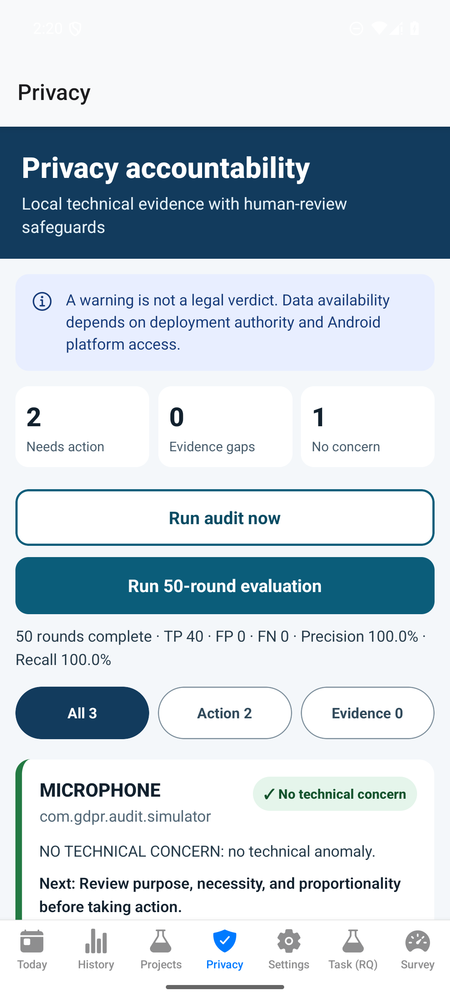
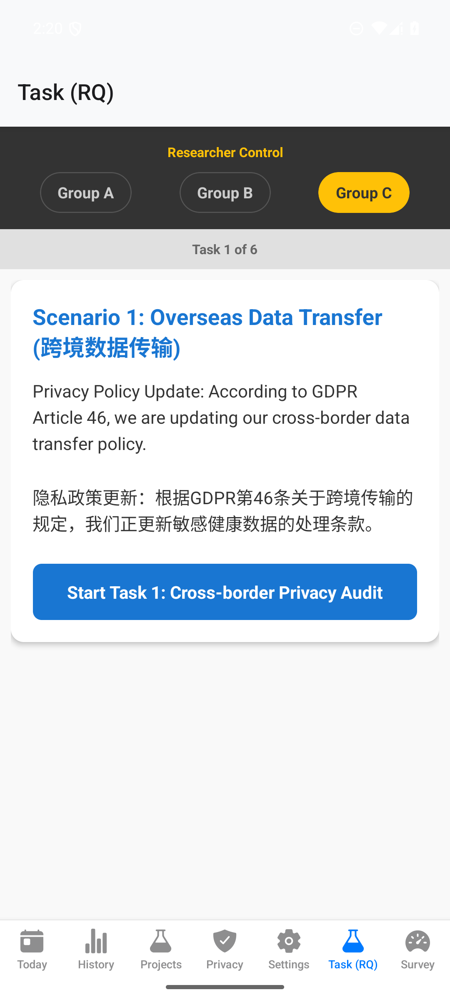

# User Guide

本指南说明如何安装和使用 GDPR Android Permission Audit 的主要功能。

## 1. 安装前准备

根目录 APK 为 `x86_64` 架构，建议安装到 Android Studio Emulator：

- Android 7.0 / API 24 或更高版本；
- 推荐 API 35 或 API 36；
- AVD 架构必须为 `x86_64`；
- 电脑已安装 Android SDK Platform Tools。

确认设备已连接：

```bash
adb devices
```

输出中应显示状态为 `device`，例如：

```text
emulator-5554    device
```

## 2. 安装 APK

在仓库根目录运行：

```bash
adb install -r GDPR-Permission-Audit-1.0.0-x86_64.apk
```

出现 `Success` 即安装完成。若设备中存在不同签名的同包名应用，需要先卸载旧版本；卸载会清除该应用的本地数据：

```bash
adb uninstall com.anonymous.mymobileapp
adb install GDPR-Permission-Audit-1.0.0-x86_64.apk
```

启动应用：

```bash
adb shell am start -n com.anonymous.mymobileapp/.MainActivity
```

## 3. 页面导航

底部导航包含七个入口：

1. **Today**：查看示例健康数据和趋势。
2. **History**：查看历史健康数据。
3. **Projects**：管理研究项目及数据需求。
4. **Privacy**：运行权限审计、执行 50 轮评估并查看合规证据。
5. **Settings**：调整隐私和应用设置。
6. **Task (RQ)**：执行研究任务。
7. **Survey**：填写研究反馈。

## 4. 使用隐私问责仪表盘

进入 **Privacy** 页面后，顶部摘要显示：

- **Needs action**：存在可能需要人工处理的结果；
- **Evidence gaps**：缺少目的、合法基础、控制者或保留期等合规上下文；
- **No concern**：当前规则未发现技术异常，不等于法律上的“合规”。

### 4.1 手动权限审计

点击 **Run audit now**：

1. Android 原生 Worker 检查本应用的位置、麦克风和联系人 AppOps 能力；
2. 结果保存于本地；
3. 完整跨应用历史是否可用取决于 Android 部署权限；
4. 审计不会拦截其他应用，也不会修改权限。

### 4.2 运行 50 轮受控评估

点击 **Run 50-round evaluation**：

1. 系统生成 40 个违规样本和 10 个控制样本；
2. 合规引擎逐一计算结果；
3. 页面显示 TP、FP、FN、Precision 和 Recall；
4. 下方结果卡片可按 **All / Action / Evidence** 筛选；
5. 点击卡片可展开技术证据、GDPR 条款、缺失信息和建议动作。



评估结果只说明规则实现是否符合受控标签，不能证明真实世界的法律准确性。

## 5. 使用研究任务

进入 **Task (RQ)**：

1. 研究人员选择 **Group A、Group B 或 Group C**；
2. 阅读当前场景与操作要求；
3. 点击蓝色 **Start Task** 按钮；
4. 在展示的交互界面中完成指定动作；
5. 点击确认按钮进入下一任务；
6. 六个任务完成后进入评分或问卷页面。



三组界面代表不同研究条件，应由研究方案预先分组，不建议参与者自行切换组别。

## 6. 随机模拟器说明

原生随机模拟器用于后台验证：

- 从 LOCATION、MICROPHONE、CONTACTS 中随机选择权限；
- 生成 50–200 个合成事件；
- 将计划时间分布在 24 小时窗口内；
- 使用 WorkManager 安排任务并记录计划时间与实际执行时间；
- 不访问真实传感器，不读取真实联系人，也不生成真实个人数据。

Android 可能延迟 WorkManager 任务，因此计划时间不应被解释为精确触发时间。

## 7. 数据与隐私

- 审计结果、模拟进度和研究状态保存在设备本地。
- 卸载应用会清除本地应用数据。
- 演示前请勿在生产设备或含真实患者资料的环境中输入敏感信息。
- 分享截图或日志前，应检查其中的软件包名、研究标识和其他可识别信息。

## 8. 常见问题

### 安装时出现 `INSTALL_FAILED_NO_MATCHING_ABIS`

设备不是 x86_64 架构。请使用 x86_64 Android Emulator，或从源码构建 ARM64 APK。

### 页面提示没有审计结果

进入 **Privacy** 后点击 **Run audit now** 或 **Run 50-round evaluation**。首次启动不会自动伪造结果。

### 其他应用的权限次数为空

这是 Android 沙箱限制。普通应用通常不能读取其他应用的完整历史，需要获得授权的 device-owner、系统权限或研究固件。

### 后台模拟未按计划时间立即执行

WorkManager 会受到 Doze、电量、后台限制和 OEM 策略影响；它保证可延迟执行，不保证精确闹钟语义。

### APK 能否直接发布到应用商店

不能。当前包使用演示调试签名且只包含 x86_64。发布前需要生成受保护的正式签名、构建 ARM64/App Bundle、完成隐私披露和真实设备测试。

## 9. 校验 APK

Windows PowerShell：

```powershell
Get-FileHash -Algorithm SHA256 .\GDPR-Permission-Audit-1.0.0-x86_64.apk
```

预期 SHA-256：

```text
E4BF799D6654A03067BB5A5995560DF4C60FDB666DCD6D8E592A69558008A14C
```
