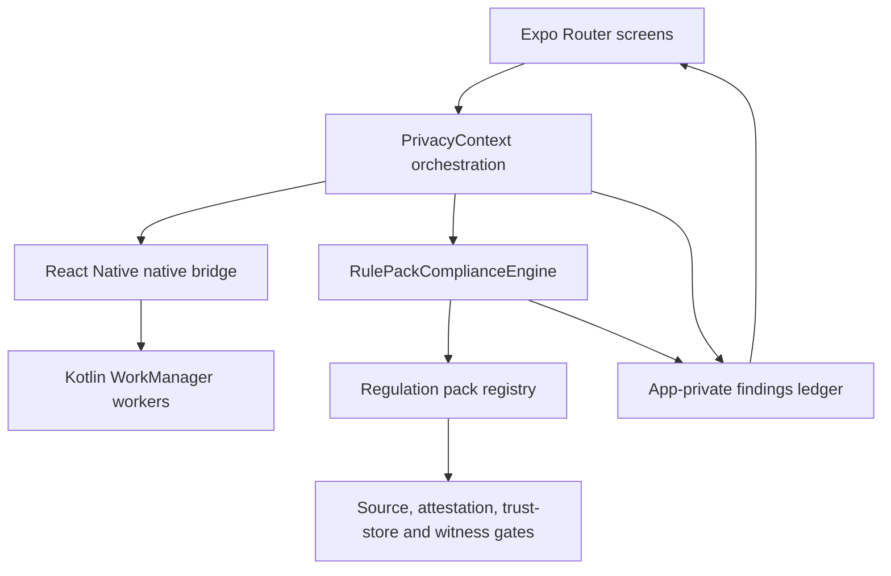

# Privacy Lens Project Manual / 项目手册

[README](../README.md) · [User guide](../User-Guide.md) · [Delivery checklist](DELIVERY-CHECKLIST.md)

## 1. Purpose and non-goals / 目的与非目标

Privacy Lens is an Android research prototype that converts limited permission-activity summaries into evidence cards for human review. The implementation is designed to preserve provenance and uncertainty rather than automate legal conclusions.

Privacy Lens 是 Android 隐私审查研究原型，将有限的权限活动摘要转化为供人工复核的证据卡片。其核心目标是保留来源和不确定性，而不是自动生成法律结论。

It is not:

- a GDPR compliance certificate or legal-advice service;
- an unrestricted cross-application monitoring product;
- a production legal-source update service or transparency log;
- a participant-data collection instrument;
- a guarantee of WorkManager timing, battery behavior, or OEM compatibility.

## 2. Runtime architecture / 运行架构



### Layer responsibilities

| Layer | Owns | Must not own |
|---|---|---|
| `app/(tabs)/` | Presentation, interaction, accessibility semantics | Rule thresholds, legal classification, evidence fabrication |
| `components/privacy/` | Shared cards and bottom navigation | Persistent governance state |
| `src/context/PrivacyContext.tsx` | Runtime orchestration, bounded local persistence, observed/synthetic entry points | Legal source definitions |
| `src/compliance/` | Input validation, deterministic evaluation, evidence and readiness state | Platform collection authority |
| `src/regulations/` | Pack definitions, source lifecycle, manifests, attestations, trust and witnesses | UI-specific rendering |
| `src/services/PrivacyBridge.ts` | Typed native-bridge boundary | Reclassifying native evidence |
| `android/.../privacy/` | AppOps capability observation and WorkManager scheduling | Unrestricted cross-app claims |

## 3. Evidence invariants / 证据不变量

These rules are release-critical:

1. Every input carries `source`: `NATIVE_BRIDGE`, `IMPORTED`, or `SIMULATOR`.
2. Unsafe types, counts, timestamps, windows, context, or sources fail closed.
3. Findings retain the regulation pack and version that produced them.
4. Synthetic records are always labelled and never promoted to observed evidence.
5. A reassuring no-concern state is blocked when source review, source bytes, legal attestation, trust-store, rollback, or witness evidence is missing or invalid.
6. Decision-pause answers do not alter the finding and are never persisted.
7. UI color is never the only carrier of status.

更改合规逻辑、法规包、原生桥接或发现卡片时，必须逐项确认以上不变量仍成立。

## 4. Governance chain / 治理链

The EU pack is a technical candidate. Its source register points to official HTTPS sources and records lifecycle/review dates. An offline source-content manifest records expected bytes and digests. A legal-review attestation can only clear when its canonical source bundle and content-manifest digests match and its Ed25519 signature chains to a current anchor. The trust-store envelope additionally requires monotonic rollback state and threshold witness receipts bound to the declared release identity.

The production roots, envelope, witness policy, receipts, and qualified legal-review attestation are empty by design. This proves the fail-closed path, not production governance. See [legal-review-key-governance.md](legal-review-key-governance.md).

EU 法规包当前是技术候选。生产根密钥、信任库封装、见证策略/回执和合格法律复核证明均为空，这是对失败关闭路径的验证，不代表已经建立生产治理。

## 5. Local data / 本地数据

| Data | Storage | Retention/control |
|---|---|---|
| Findings ledger | AsyncStorage, app-private | Newest 100; user can clear it |
| Active regulation pack | AsyncStorage, app-private | Until changed or app data is removed |
| Trust-store rollback state | AsyncStorage, app-private | Monotonic while state survives |
| Decision-pause answers | React component state | Cleared when the finding closes |
| Synthetic evaluation summary | In-memory UI state | Current app session |

Android backup is disabled. App-private storage is not tamper-resistant. Uninstall, data clearing, unsuitable restore, or device compromise can remove rollback history.

## 6. Development setup / 开发环境

Required baseline:

- Node.js 20 or later and npm;
- Java 21;
- Android SDK/compile target 36;
- Expo 54-compatible Android NDK;
- PowerShell 5+ on Windows for the included QA scripts.

```powershell
npm ci
npm run verify
npm start
```

If Node is not on `PATH`, set `NODE_BINARY` to the absolute `node.exe` path before invoking Gradle. Both Android settings and app build configuration honor that variable.

`npm run verify` recompiles compliance tests before execution. Do not trust stale `.compliance-test-build` output. The command runs:

1. compliance, extended, and governance/property suites;
2. accessibility source contracts;
3. release-privacy contracts;
4. application TypeScript;
5. ESLint;
6. delivery structure, version, and Markdown-link verification.

### Android release candidate

```powershell
$env:NODE_ENV = 'production'
Set-Location android
.\gradlew.bat assembleRelease bundleRelease --no-daemon --console=plain -PreactNativeArchitectures=arm64-v8a
```

Release outputs are intentionally ignored. Record hashes, package/version, signing scheme, certificate boundary, manifest permissions, installation mode, device identity, and short-run limitations in a new versioned report. Never commit owner upload keys.

## 7. Safe extension workflow / 安全扩展流程

### Add a regulation pack

1. Implement `RegulationPack` under `src/regulations/packs/`.
2. Provide explicit kind, jurisdiction, source records, lifecycle, review dates, rules, context requirements, classification policy, governance state, and caveat.
3. Add a source-content manifest only for a legal framework.
4. Register the pack in `src/regulations/registry.ts`.
5. Add malformed-input, source lifecycle, governance, and historical-finding tests.
6. Do not label a pack legally reviewed without real qualified review and verifiable production evidence.

### Change native evidence collection

1. Document the Android API and deployment authority actually available.
2. Preserve `source` and capability limitations at the bridge boundary.
3. Never substitute fabricated counts when AppOps access is restricted.
4. Add device evidence, UI hierarchy, crash-buffer, and permission-manifest checks.
5. Bound claims to the tested device, duration, and flow.

### Change a finding or decision flow

1. Keep observations visible before recommendations.
2. Preserve provenance, missing evidence, caveats, pack identity, and legal-review state.
3. Retain accessible roles, labels, state, 44-point targets, non-color status, and large-text reflow.
4. Ensure decision-support answers remain session-only unless a separately reviewed research protocol explicitly changes that boundary.

## 8. Repository evidence policy / 仓库证据策略

- Thesis `.tex` files and PDFs are append-only versioned evidence; do not overwrite prior revisions.
- `testing-report/` stores acceptance summaries and minimized evidence. Do not commit full `logcat`, `jobscheduler`, raw device dumps, intermediate screenshots, or unnecessary identifiers.
- Use `assets/screenshots/` only for the final README-facing screenshots.
- IDE state, local bundles, APK/AAB files, secrets, and dependency/build caches are ignored.
- Every broad claim must name its evidence scope and limitation.

## 9. Release handoff / 发布交接

Before publishing a branch:

1. run `npm ci` and `npm run verify` from a clean checkout;
2. build with the intended ABI and inspect the merged release manifest;
3. validate on the target device using UI-tree coordinates, not screenshot guesses;
4. minimize evidence and scan the full branch tree for excluded files;
5. update versioned reports, screenshots, README, user guide, privacy policy, and store-readiness state;
6. commit intentionally, push without force, then independently fetch the remote branch and verify its hash/tree.

The owner must separately provide production signing, monitored contact details, a stable HTTPS privacy-policy URL, Play declarations/listing, and any required legal, ethics, accessibility, security, or participant review.
